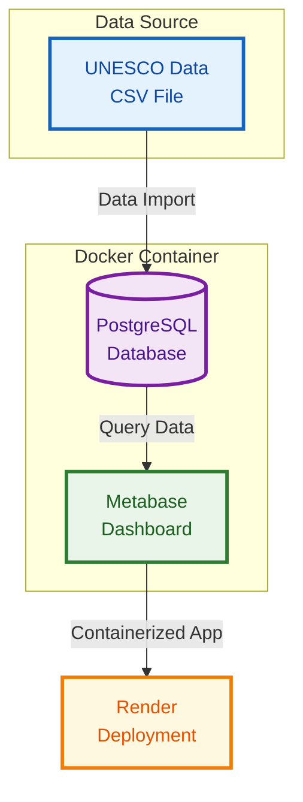

# Journalist Fatalities Dashboard | Data Analytics Portfolio Project


## 🎯 Project Overview

An **interactive dashboard** showing global journalist fatalities from 1992-present, leveraging UNESCO's official dataset to uncover critical insights about press safety worldwide. This project demonstrates end-to-end data analytics capabilities from data sourcing to deployment.

**Key Achievement:** Transformed raw UNESCO data into an interactive dashboard serving journalists, researchers, and press freedom organizations with actionable insights about media safety trends.

## 📊 Key Findings & Insights

- The number of journalist fatalities is increasing over time since 1992.
- Most of the journalist killed are middle-aged.
- About 1/4 of the fatalities are in Asia and 1/4 in Latin America.
- Most of the journalist killed are males.
- Being in a conflict zone does not significantly increase the risk to get killed.
- The media most exposed to fatalities are print and TV.


## 🛠️ Technical Implementation

- **Database Architecture**: PostgreSQL 
- **Interactive dashboard**: Metabase
- **ETL Pipeline**: Data processing workflows from CSV to production database
- **Cloud Deployment**: Containerized deployment on Render platform


## 🏗️ Project Architecture



## 📈 Dashboard Showcase

### Overview


### Geographic breakdown

*The number of journalist fatalities is increasing over time since 1992.*

### Fatalities by age

*Most of the journalist killed are middle-aged.*

### Demographic breakdown

*Most of the journalist killed are males. About 1/4 of the fatalities are in Asia and 1/4 in Latin America*

### Media and conflict zone breakdown

*Being in a conflict zone does not significantly increase the risk to get killed. The media most exposed to fatalities are print and TV.*


## 🔧 Installation & Deployment


### 1. Database Setup

1. Connect to postgres with user postgres
```bash
sudo -u postgres psql
```

2. Create database
```sql
CREATE DATABASE unesco_db;
```

CTRL + D to exit postgres.

3. Create personal user
```sql
CREATE USER my-user WITH PASSWORD 'my-password';
```
4. Grant all permissions
```sql
GRANT ALL PRIVILEGES ON DATABASE unesco_db to my-user;
```
CTRL + D to exit postgres.

5. Create schema and table and import CSV data

```bash
# clone repo
git clone https://github.com/PierreExeter/journalist-fatalities-dashboard

cd journalist-fatalities-dashboard

# Execute sql script
psql -U my-user -d unesco_db -f create_journalists_table.sql
```

6. Check that the table was created properly

```bash
# Connect to database with my-user
psql -U my-user -d unesco_db
```

```sql
SET search_path TO journalists_schema, public;

-- list tables
\dt

-- Display table
SELECT ID, "Title En", Countries, "Date", "Enquiry status" FROM journalists_schema.killed_journalists LIMIT 5;
```
CTRL + D to exit postgres.


### 2. Metabase Configuration

1. Pull Metabase container

```bash
docker pull metabase/metabase:latest
```

2. Run container and connect to localhost network
```bash
docker run -d -p 3000:3000 --network host --name metabase metabase/metabase
```

3. Navigate to [http://localhost:3000](http://localhost:3000)
4. Set up admin account
5. Add PostgreSQL database connection:
   - **Host**: `host.docker.internal`
   - **Port**: `5432`
   - **Database**: `unesco_db`
   - **Username**: `my-user`
   - **Password**: `my-password`

6. Create the questions and dashboard in Metabase GUI 
(See [Metabase tutorial](https://www.youtube.com/watch?v=7esMaFvKGqo) for help).

### 3. Cloud Deployment on Render

This project is production-ready and can be deployed directly to Render:

[](https://render.com/deploy?repo=https://github.com/PierreExeter/journalist-fatalities-dashboard)


See the Render [guide](https://render.com/docs/deploy-metabase) for Metabase deployment.


## Credits

*The [dataset](https://data.unesco.org/explore/dataset/fej001/information/?disjunctive_nationality=&disjunctive_gender=&disjunctive_local=&disjunctive_media=&disjunctive_country_title_en=&disjunctive_staff=&disjunctive_enquiry_status=&disjunctive_date_resolution=&disjunctive.nationality&disjunctive.gender&disjunctive.local&disjunctive.media&disjunctive.country_title_en&disjunctive.staff&disjunctive.enquiry_status&disjunctive.date_resolution) is from the Unesco datahub. The original Unesco dashboard can be found [here](https://www.unesco.org/en/safety-journalists/observatory/statistics?hub=72609).*
